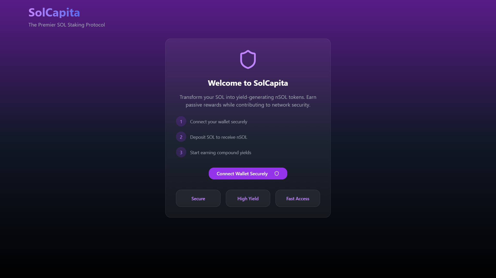
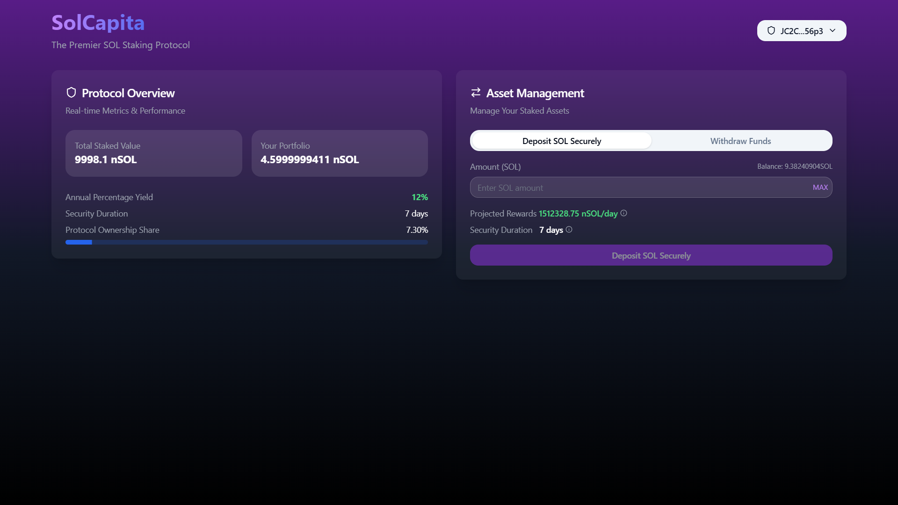
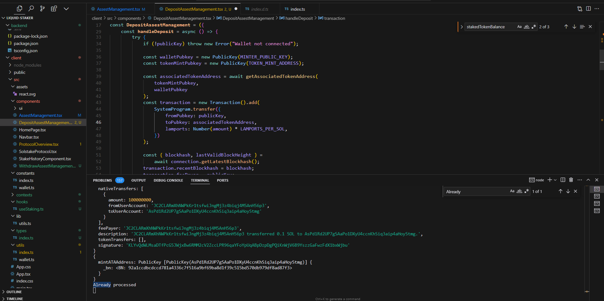
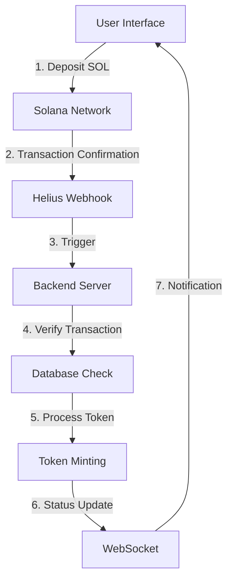

# SolCapita

## Overview

This SolCapita App is a decentralized application (dApp) that allows users to stake their Solana tokens and earn rewards. Built on the Solana blockchain, this app provides a seamless and efficient staking experience with real-time updates and secure transactions.

## Demo & Screenshots

### Video Demo

[](https://www.youtube.com/watch?v=FVNFxiO6NXU)

Click the image above to watch the demo video on YouTube.

### Screenshots

#### Home Page


_Main dashboard showing staking interface_

#### Staking Process


_Real-time staking transaction flow_

#### Staking Complete


_Staking complete_

## Features

-   User-friendly interface for staking and burning staking tokens
-   Real-time reward calculation and distribution
-   Secure wallet integration
-   Transaction history
-   Mobile-responsive design

## Technology Stack

-   **Frontend**: React.js, TypeScript, Tailwind CSS , shadcn/ui
-   **Backend**: Node.js, Express.js, TypeScript , Mongoose
-   **Blockchain**: Solana , Web3.js
-   **Database**: MongoDB
-   **State Management**: Context API
-   **API**: RESTful API, WebSocket for real-time updates (socket.io)

## Prerequisites

Before you begin, ensure you have the following installed:

-   Node.js (v14.x or later)
-   npm (v6.x or later)
-   Solana CLI tools

## Setup and Installation

1. Clone the repository:

    ```
    git clone https://github.com/nishantcoder108/solcapita.git
    cd solcapita
    ```

2. Install dependencies:

    ```
    # Install frontend dependencies
    cd client
    npm install

    # Install backend dependencies
    cd ../backend
    npm install
    ```

3. Set up environment variables:

    - Copy `.env.example` to `.env` in the `backend` and in client directory
    - Fill in the required environment variables

4. Set up the database:

    ```
    docker pull mongo
    docker run --name mongodb -d -p 27017:27017 -v mongo-data:/data/db mongo
    ```

## Running the Application

1. Start the backend server:

    ```
    cd backend
    npm run dev
    ```

2. Start the frontend development server:

    ```
    cd client
    npm start
    ```

3. Access the application at `http://localhost:5173` for frontend and `http://localhost:5000` for backend

## Application Flow

### User Interaction Flow

1. **Initial Connection**

    - User connects their Solana wallet (e.g., Phantom)
    - Application establishes WebSocket connection for real-time updates

2. **Deposit Process**
    - User inputs desired SOL amount for staking
    - Clicks "Deposit Sol Securely" to initiate transaction
    - Phantom wallet prompts for transaction approval

### Backend Processing Flow

1. **Transaction Verification**

    - Helius webhook triggers upon successful transaction
    - Backend validates:
        - Transaction type
        - Authorization parameters
        - Transaction signature uniqueness in database

2. **Token Processing**
    - System checks/creates Associated Token Account (ATA)
    - Initiates minting process for staking tokens
    - Real-time status updates via WebSocket

### Technical Implementation Details



1. **Frontend Layer**

    - React/TypeScript interface for user interactions
    - Real-time WebSocket listeners for transaction updates
    - Phantom wallet integration for secure transactions

2. **Blockchain Layer**

    - Solana network transaction processing
    - Web3.js for blockchain interactions
    - Associated Token Account management

3. **Backend Layer**

    - Express.js server handling webhook events
    - MongoDB for transaction signature verification
    - Socket.io for real-time client communication

4. **Monitoring Layer**
    - Helius webhook integration for transaction monitoring
    - Real-time status tracking and notifications
    - Transaction verification and validation

### Security Measures

-   Transaction signature verification
-   Duplicate transaction prevention
-   Secure WebSocket connections
-   Environment variable protection
-   Wallet authorization checks
